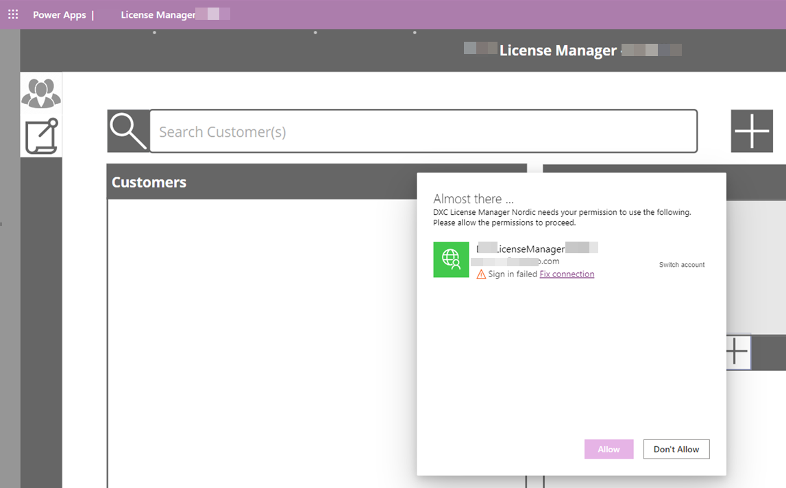
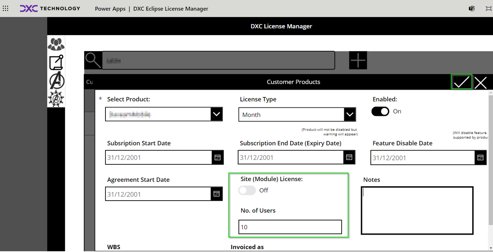

# Frequently Asked Questions

## Version and Support Information

Where can I find contact information for support?  
Email: ECLANZProductSupport@dxc.com

## Dependency and Security Information

License Manager includes

- Use of Microsoft Azure Application Insights library
- Makes secure HTTPS connections for license validation in accordance to the Microsoft security standards

_Customer telemetry retrieved by the license manager_

- Serial number
  - Used to uniquely identify a customer environment for license validation.
  - RSA encrption key is used for securing the serial number in the license server validation responses.
  - FinOps License Manager module verifies the response before extracting results from the payload.

_Other telemetry retrieved relating to the ISV product installed_

- Product name - Name of installed ISV product.
- Model name - Name of the installed ISV product's FinOps model
- Model version - Installed ISV product's FinOps model version
- Host url - URL of the host environment where the ISV product is installed.
- Is enabled - Current license status for the installed ISV product.
- Is installed - Indicates if ISV product is installed.
- Is production environment - Indicates if environment is a production environment.

All telemetry is collected and logged within Microsoft Azure Application Insights.

Note: License Manager does not collect any other information other than those specified above. It does not reference or collect any telemetry against any other installed system or ISV modules.

## Dynamics 365 Finance and Operations

### Customers receiving "Product XXX is enabled but not licensed" prompt in D365FO

<b> Only a few users experience the issue but works for the rest of the organization</b>

Please verify if there is no issue relating to network latency

<b> Multiple or all users experience the issue</b>

Please contact your system administrator to confirm if manually performing validate license within System parameters > Product licenses > Validate license resolves the issue.

<b> Prompt is referring to a subset of the products </b>

Please contact your licensing personnel to confirm whether the licenses are still active.

<b> Prompt occurs for all products </b>

In the case of such an event, please reach out to the DXC Product support team or [subscribe](./MARKETING-COMMUNICATIONS/subscribe.html) to get notifications.  
DXC Product Support Team periodically sends out notifications in the event of a downtime or scheduled update.

## Troubleshooting

1. Prompt with fix connection when accessing the Power App.  
   
   The Power App platform requires consent to authenticate and provide access to the license manager service. This prompt appears everytime a new session is started to an existing session expires due to no user input. The standard expiration time for the access token is 60 minutes. While the app is in use, it will be able to auto-refresh the access token.
1. Connection error when accessing Power App after a new release is applied
   
   Please refer to the instalaltion instructions located at the end of this documentation [here](./PowerApp). For detailed technical documentation, please email the support team, ECLANZProductSupport@dxc.com
1. I can’t save ‘Customer Products’.
   Reason: Field ‘Site (Module) License’ is set to Off OR ‘No. of users’ field is blank

Before:

After:

